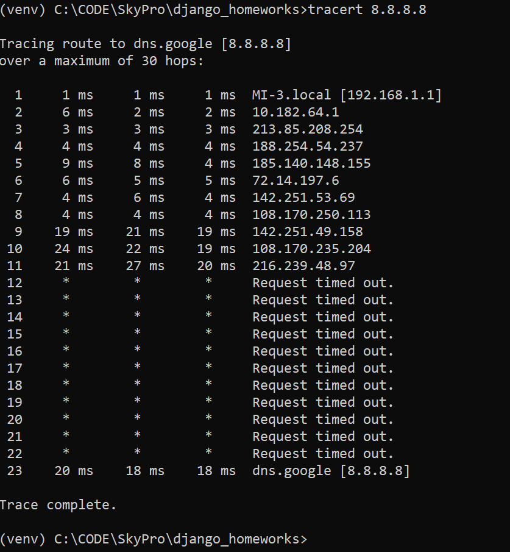
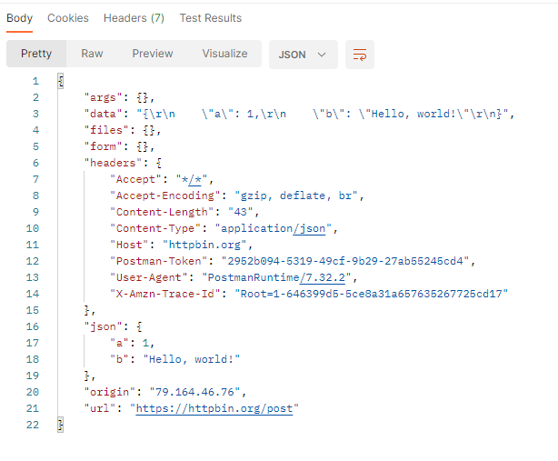

# Домашнее задание по теме «Основы веба»

## Задание 1.

Определите путь от своего компьютера до сервера с IP-адресом 8.8.8.8 с помощью утилиты 
`traceroute`

**Ответ:**  

## Задание 2.
- С помощью инструмента Postman отправьте POST-запрос по адресу https://httpbin.org/post.  
- В теле запроса передайте JSON-объект с произвольными данными.  
- В заголовке укажите тип данных JSON.  
- В ответе приложите скриншот, на котором видно возвращаемые данные.

**Ответ:**  

## Задание 3.

Создайте простое веб-приложение, которое будет на любой GET-запрос возвращать текст Hello, World wide web!.

**Дополнительно к заданию 3**  
Реализуйте в вашем веб-приложении прием POST-запроса и печать в консоль всех данных, которые были приняты от пользователя. Протестируйте решение через Postman.

**Ответ:**  
Решение задачи расположено в файле [task03.py](task03.py)
